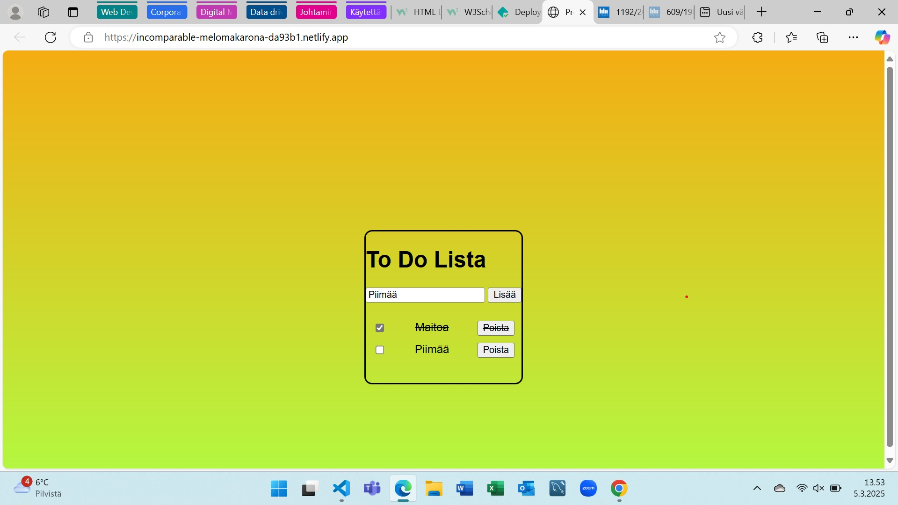

Project Title
The name of this Javascript Project 1 is To Do List, and it is made by Tomi HAukka.

Demo link:
https://incomparable-melomakarona-da93b1.netlify.app/

How was the workload divided
I made this project by myself.

Screenshots

Technologies
I used in this project HTML, CSS and Javascript. HTML and CSS was familiar to me before from developing websites course. In this course we are studying Javascript, so it is new thing to me to learn.

Setup

Just click the link: https://incomparable-melomakarona-da93b1.netlify.app/ and there will be ready to use To Do List.

Credits
I used W3school and this courses materials in this project. I also used Copilot when I couldn't get my JavaScript to work in some sections despite numerous attempts.